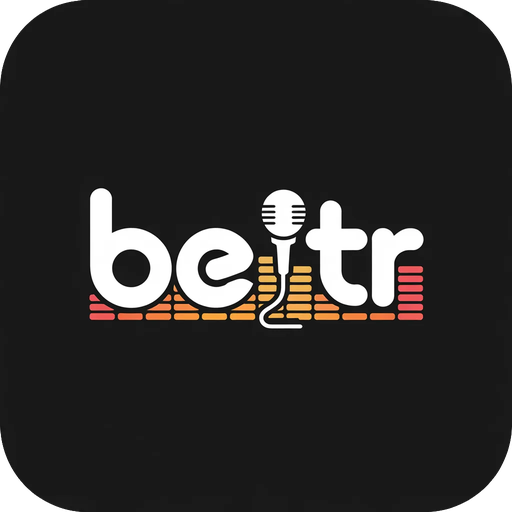
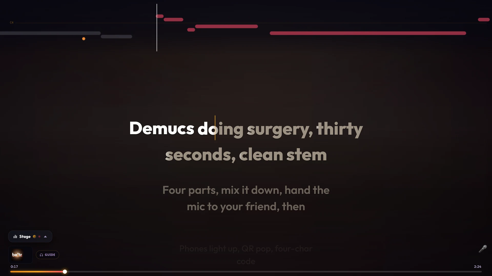

# Beltr for Unraid

Unraid Community Applications templates for **Beltr**, a self-hosted karaoke
server. It takes a song from your own music library, separates the vocals out
with a local AI model, finds or transcribes synced lyrics, and puts the words on
a TV while everyone's phone acts as a remote. Guests scan the QR code on screen;
there is no app for them to install.

Everything runs on your server. Nothing about your library is uploaded.

[beltr.app](https://beltr.app) &middot; [Full Unraid guide](docs/UNRAID.md) &middot; [Support](https://github.com/CasaVargas/beltr-releases/issues)



## Which template

Install one, not both. They share the same default paths.

| Template | Image | Use it when |
|---|---|---|
| **Beltr** | `ghcr.io/casavargas/beltr:latest` | Any server. Separating a song takes a few minutes on a modern multi-core CPU. |
| **Beltr-NVIDIA** | `ghcr.io/casavargas/beltr:latest-cuda` | You have an NVIDIA GPU and the Unraid Nvidia-Driver plugin. Separation drops to well under a minute. |

The GPU image falls back to the CPU if passthrough is misconfigured, so a broken
setup looks *slow* rather than broken. Confirm the card was found in Settings
after install.

## Install

**Community Applications:** Apps, search Beltr, pick one of the two, set the
four paths, Apply. Then open the WebUI, go to Settings, and add `/media` as a
music folder. Beltr never scans your library until you point it at one.

**Plain Docker:**

```bash
docker run -d --name beltr \
  -p 8477:8477 \
  -e PUID=99 -e PGID=100 -e TZ=America/New_York \
  -v /mnt/user/appdata/beltr:/config \
  -v /mnt/user/beltr:/library \
  -v /mnt/user/appdata/beltr-cache:/cache \
  -v /mnt/user/Music:/media:ro \
  --restart unless-stopped \
  ghcr.io/casavargas/beltr:latest
```

**Compose:** [`docker-compose.yml`](docker-compose.yml) with
[`.env.example`](.env.example) as a starting point. Pick one profile:

```bash
cp .env.example .env        # edit PUID/PGID and the paths
docker compose --profile cpu up -d      # or --profile gpu
```

## The four paths

| Mount | Holds | Size | Put it on |
|---|---|---|---|
| `/config` | Database, settings, logs, lyrics | under 500 MB | Cache pool / SSD (`appdata`) |
| `/library` | Separated stems and imported audio | **60-120 MB per song** | The array |
| `/cache` | AI model weights | ~2 GB, once | Cache pool / SSD |
| `/media` | Your music, read-only | n/a | Wherever it already is |

Two of these matter more than they look. **`/library` must not live in
`appdata`**, because every processed song leaves a pair of lossless stems behind
and a few hundred songs will fill a cache pool sized for config files. And
**`/cache` must stay mapped**, or the ~2 GB of model weights are re-downloaded
every time you update the image.

## Worth knowing before you install

- **First run downloads about 2 GB** of model weights into `/cache`. Once. If a
  first song seems to sit still, that is what it is doing: `docker logs -f beltr`.
- **Microphones need HTTPS.** Browsers only expose the microphone on a secure
  page, so scoring and phone-as-mic need Beltr behind a reverse proxy with a
  certificate. Queueing, playback, lyrics and stem mixing all work fine over
  plain http. [Details](docs/UNRAID.md#microphones-need-https).
- **Beltr assumes everyone who can reach it is trusted.** Room joins are open by
  design so a guest can scan a QR code and sing. `AUTH_PASSWORD` puts a password
  on the TV and dashboard screens, but do not port-forward this container.
- **AMD and Intel GPUs are not supported.** Not an oversight; the separation
  model's complex-valued STFT is not reliable on those paths.

## Licensing

Beltr is a **one-time purchase**, not a subscription. The container runs free
for five songs so you can try it against your own music, then asks for a key
from [beltr.app](https://beltr.app). Activation happens once and then works
offline; updating or recreating the container does not re-activate, as long as
you keep `/config`. A key covers two installs.

> The MIT license in this repository covers **these templates and docs only**.
> Beltr itself is proprietary software distributed under its own EULA.

## Keeping up

Templates here are copied from the Beltr application repository, which is where
they are edited. File issues and support requests at
[CasaVargas/beltr-releases](https://github.com/CasaVargas/beltr-releases/issues).
